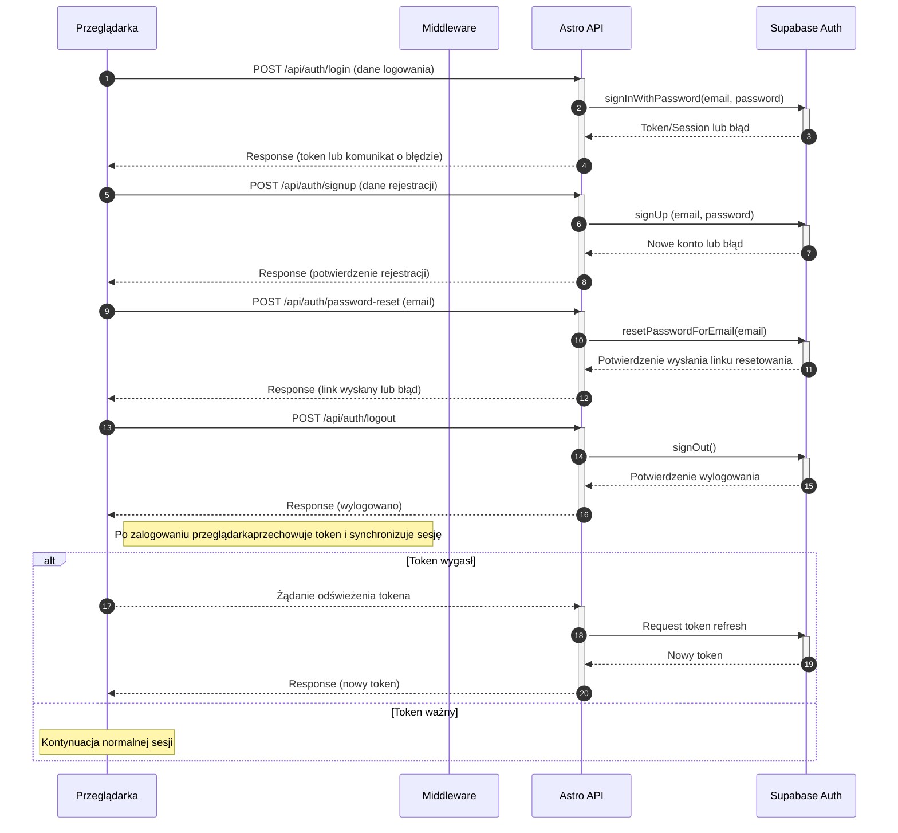

<authentication_analysis>
Diagram przedstawia pełny cykl autentykacji wykorzystywany w aplikacji. 
Główni aktorzy to:
- Przeglądarka (interfejs użytkownika)
- Middleware (obsługa sesji i wstępna konfiguracja)
- Astro API (endpointy autoryzacyjne, np. /api/auth/login, /api/auth/signup, /api/auth/logout, /api/auth/password-reset)
- Supabase Auth (mechanizm autentykacji Supabase, odpowiadający za signIn, signUp, signOut oraz reset hasła)

Procesy autentykacji:
1. Logowanie: 
   - Użytkownik wypełnia formularz logowania w przeglądarce.
   - Przeglądarka wysyła żądanie (POST /api/auth/login) z danymi logowania do Astro API.
   - Astro API wywołuje metodę signInWithPassword na Supabase Auth.
   - Supabase Auth weryfikuje dane i zwraca token sesji lub błąd.
   - Token jest przekazywany do przeglądarki, która rozpoczyna sesję.

2. Rejestracja:
   - Użytkownik wypełnia formularz rejestracji.
   - Przeglądarka wysyła żądanie (POST /api/auth/signup) do Astro API.
   - Astro API kieruje dane do Supabase Auth, wywołując metodę signUp.
   - W odpowiedzi użytkownik otrzymuje potwierdzenie utworzenia konta lub komunikat o błędzie.

3. Odzyskiwanie hasła:
   - Użytkownik inicjuje proces resetu hasła (POST /api/auth/password-reset).
   - Astro API wywołuje metodę resetPasswordForEmail na Supabase Auth.
   - Użytkownik otrzymuje potwierdzenie wysłania linku resetującego.

4. Wylogowywanie:
   - Użytkownik wysyła żądanie wylogowania (POST /api/auth/logout).
   - Astro API wywołuje metodę signOut na Supabase Auth, co kończy sesję.

5. Odświeżanie tokenu:
   - W przypadku wygasłego tokena, przeglądarka wykrywa błąd autoryzacji i wysyła żądanie odświeżenia tokena.
   - Astro API kontaktuje się z Supabase Auth, aby uzyskać nowy token, który jest przekazywany z powrotem do przeglądarki.
</authentication_analysis>

<mermaid_diagram>

</mermaid_diagram> 